# Quest Generator Flowchart

## Overview
The Quest Generator assembles quests from database components using tag-driven selection. This flowchart follows best software development practices with clear decision points, modular processing stages, and scalability considerations.

**File Format:** Mermaid Source (renderable to SVG/PNG/PDF)

## Flowchart

```mermaid
flowchart TD
    %% Style Definitions
    classDef startEnd fill:#2a9d8f,stroke:#1d3557,color:#fff,stroke-width:2px
    classDef process fill:#264653,stroke:#1d3557,color:#fff,stroke-width:2px
    classDef decision fill:#e9c46a,stroke:#1d3557,color:#1d3557,stroke-width:2px
    classDef database fill:#e76f51,stroke:#1d3557,color:#fff,stroke-width:2px
    classDef dataInput fill:#f4a261,stroke:#1d3557,color:#1d3557,stroke-width:2px
    classDef subsystem fill:#8ab17e,stroke:#1d3557,color:#1d3557,stroke-width:2px
    
    %% Start/End Nodes
    A([Start: Quest Request]):::startEnd
    ZZ([End: Quest Ready]):::startEnd
    
    %% Data Input Stage
    B1[Receive Quest Parameters]:::dataInput
    B2[• Length: Short/Medium/Long]
    B3[• Theme Tag: e.g. Undead, Bandits, Human Settlement]
    B4[• Quest Type Tag: e.g. Escort, Retrieval, Clear-out]
    B5[• Difficulty Rating: 1-10 Scale]
    
    %% Tag Database Query
    C1[Query Tag Database]:::database
    C2[Filter: Theme Tag > Encounter Pieces]
    C3[Filter: Quest Type Tag > Encounter Templates]
    C4[Filter: Difficulty Rating > Target Rolls]
    
    %% Encounter Assembly
    D1[Determine Encounter Count]:::process
    D2[Calculate based on Length]
    
    E1[Assemble Main Encounter]:::subsystem
    E2[Select main objective template]
    E3[Match theme/quest type tags]
    E4[Scale difficulty to rating]
    
    F1[Assemble Lead-up Encounters]:::subsystem
    F2[Select lead-up templates]
    F3[Check tag coherence]
    F4[Validate difficulty progression]
    
    G1[Assemble Optional Side Encounters]:::subsystem
    G2[Evaluate probability for each]
    G3[Select from available pool]
    G4[Apply difficulty scaling]
    
    %% Approach Database Integration
    H1[Integrate Approach Database]:::database
    H2[Assign approaches to each encounter]
    H3[Approach = Skill Check + Stats]
    H4[Combat encounters use combat rules]
    
    %% Validation
    I1[Validate Quest Coherence]:::process
    I2{Total Encounters within Range?}
    I3{Theme consistency maintained?}
    I4{ difficulty balanced?}
    I5[Yes]
    I6[No - Re-roll Encounters]
    
    %% Output
    J1[Return Complete Quest Object]:::startEnd
    
    %% Data Flow Connections
    A --> B1
    B1 --> B2 --> B3 --> B4 --> B5
    
    B5 --> C1
    C1 --> C2 --> C3 --> C4
    
    C4 --> D1 --> D2
    D2 --> E1 --> E2 --> E3 --> E4
    E4 --> F1 --> F2 --> F3 --> F4
    F4 --> G1 --> G2 --> G3 --> G4
    G4 --> H1 --> H2 --> H3 --> H4
    
    H4 --> I1
    I1 --> I2
    I2 -->|No| I6 --> C1
    I2 -->|Yes| I3
    I3 -->|No| I6
    I3 -->|Yes| I4
    I4 -->|No| I6
    I4 -->|Yes| I5 --> J1
    
    class A,ZZ startEnd
    class B1,B2,B3,B4,B5 dataInput
    class C1,C2,C3,C4 database
    class D1,D2 process
    class E1,E2,E3,E4,F1,F2,F3,F4,G1,G2,G3,G4,H1,H2,H3,H4 subsystem
    class I1,I2,I3,I4,I5,I6,I5 process
    class J1 startEnd
```

## Processing Flow Description

### 1. Input Stage
- **QuestParameters**: Collected via player interaction or automated system
- **Validation**: Parameters must be within valid ranges

### 2. Tag Filtering (Database Layer)
- **Theme Tags**: Filter encounters by setting/flavor (Undead, Bandits, etc.)
- **Quest Type Tags**: Filter by structural objective (Escort, Retrieval, Clear-out)
- **Difficulty Tags**: Scale encounter difficulty to target rating

### 3. Encounter Assembly
- **Main Encounter**: Core objective, must be won for quest completion
- **Lead-up Encounters**: Progression before main encounter
- **Side Encounters**: Optional detours with variable reward

### 4. Approach Integration
- **Appraisal Phase**: Each encounter gets available approaches
- **Skill Check Based**: Non-combat approaches resolved by stats
- **Combat Fallback**: Combat encounters use turn-based resolution

### 5. Validation Pipeline
- Loop back on incoherent assemblies
- Ensure thematic consistency
- Balance difficulty progression

## Scalability Considerations

1. **Tag Database**: Extensible tag system supports future content
2. **Approach Table**: New approaches can be added without engine changes
3. **Difficulty Scaling**: Linear rating system allows smooth difficulty curve
4. **Loop Prevention**: Minimum/maximum encounter counts prevent infinite loops

---

*Source: Guild Manager Requirements Document v0.8*
*File Format: Mermaid Source (.mmd) - Renderable to SVG, PNG, or PDF*